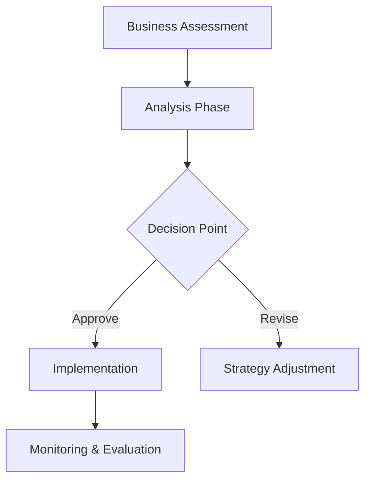
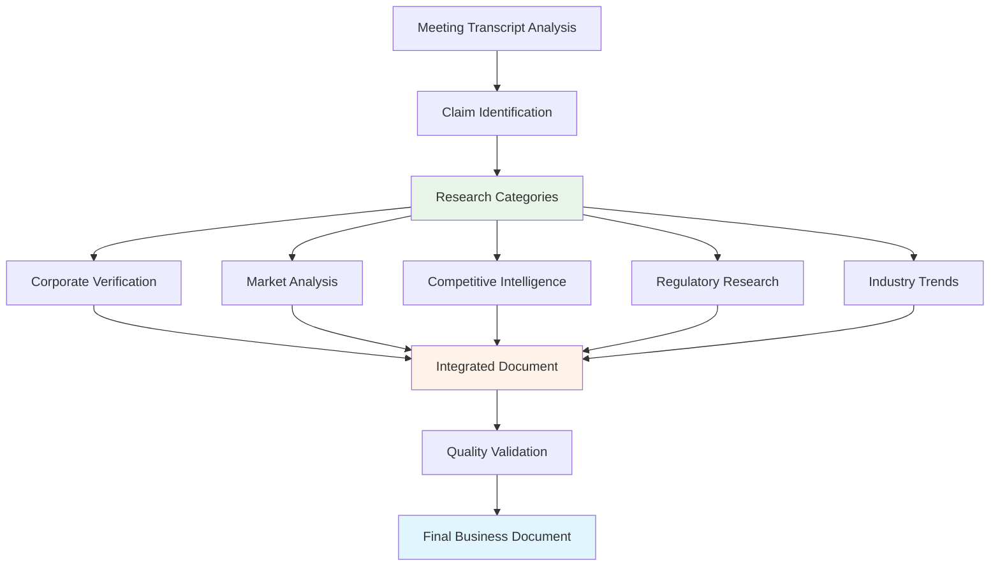
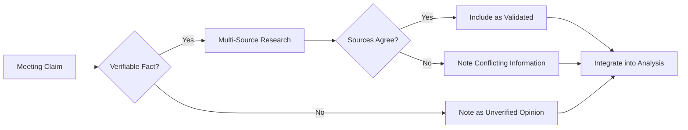
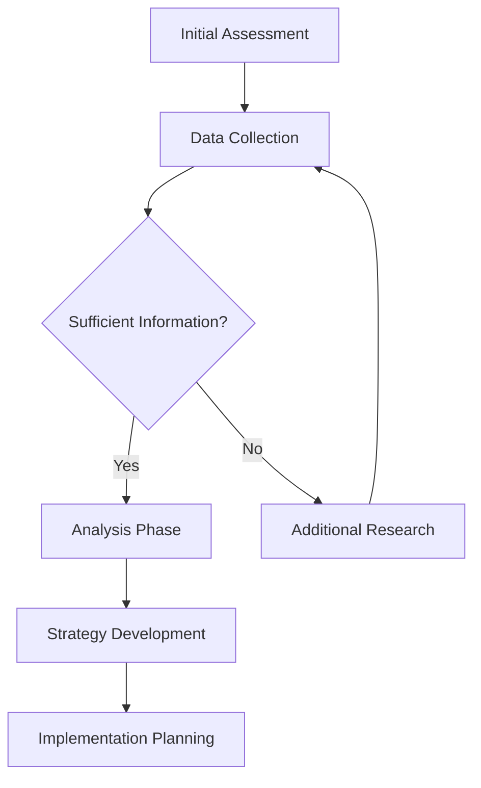
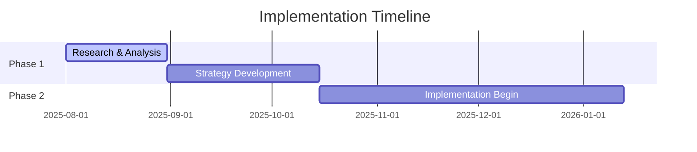
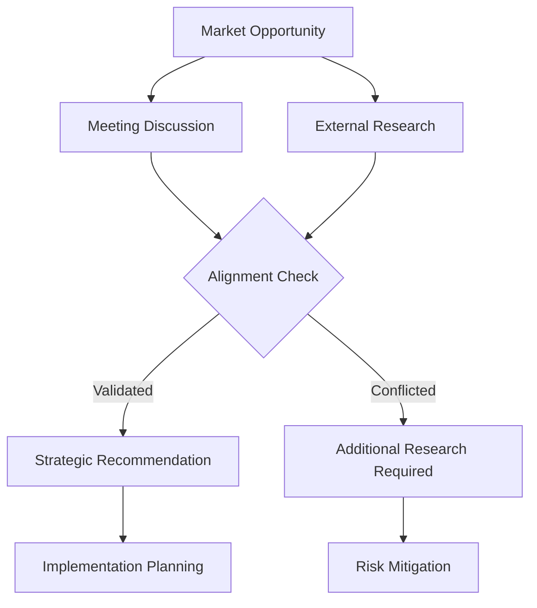
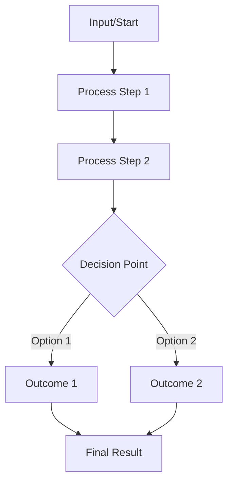

# Comprehensive Guidelines: Transforming Meeting Transcripts into Professional Business Documents with Research Integration

## Table of Contents

1. [Overview & Philosophy](#overview--philosophy)
2. [Document Structure Framework](#document-structure-framework)
3. [Essential Elements for Every Section](#essential-elements-for-every-section)
4. [Quote Integration Best Practices](#quote-integration-best-practices)
5. [Web Research Integration Framework](#web-research-integration-framework)
6. [Visual Element Requirements](#visual-element-requirements)
7. [Analytical Framework](#analytical-framework)
8. [Quality Assurance & Fact-Checking](#quality-assurance--fact-checking)
9. [Templates & Examples](#templates--examples)

---

## Overview & Philosophy

The transformation of meeting transcripts into comprehensive business documents serves multiple strategic purposes: creating actionable records, enabling systematic analysis, facilitating decision-making, and establishing professional documentation standards. This methodology converts informal conversation into structured business intelligence.

**Core Principles:**

• **Comprehensive Coverage:** Every major topic discussed must be documented with appropriate depth and context
• **Attribution Accuracy:** All quotes must be properly attributed to speakers with exact wording preserved
• **Multi-Modal Communication:** Combine text, bullet points, tables, and visual diagrams for maximum clarity
• **Action-Oriented Focus:** Transform discussions into implementable strategies and measurable outcomes
• **Professional Standards:** Maintain business-grade documentation suitable for stakeholder review and legal reference

**Document Purpose Framework:**

| Document Type | Primary Purpose | Key Elements | Success Metrics |
|--------------|----------------|--------------|----------------|
| Strategic Planning | Decision support & roadmapping | Analysis, risks, timelines | Actionable insights identified |
| Partnership Review | Relationship management | Agreements, responsibilities | Clear accountability established |
| Investment Analysis | Financial decision-making | Performance, projections, risks | Investment recommendations |
| Operational Review | Process improvement | Efficiency, optimization | Implementation roadmap created |

---

## Document Structure Framework

### 1. Executive Summary Structure

**Required Components:**
- Meeting context and participant identification
- Key topics covered with brief overview
- Critical decisions or insights identified  
- Strategic implications and next steps
- Bullet-point summary of major themes

**Example Template:**
```markdown
## Executive Summary

This document analyzes a [duration] meeting between [participants] covering [primary topics]. The discussion reveals [key insights] with implications for [strategic areas].

[Primary participant] outlined their [key position/strategy]: *"[significant quote]"* This [analysis of quote significance].

[Second key insight with supporting quote and analysis]

**Key Meeting Insights:**
• [Bullet point 1]
• [Bullet point 2]  
• [Bullet point 3]
• [Bullet point 4]
```

### 2. Main Content Section Architecture

**Section Hierarchy:**
1. **Primary Business Area** (e.g., Real Estate Portfolio)
   - **Subsection A** (e.g., Current Operations)
     - **Detail Level 1** (e.g., Property Performance)
     - **Detail Level 2** (e.g., Management Structure)
   - **Subsection B** (e.g., Optimization Opportunities)
     - **Detail Level 1** (e.g., Professional Management)
     - **Detail Level 2** (e.g., Digital Infrastructure)

**Required Elements Per Main Section:**
- Opening paragraph with context and speaker attribution
- Multiple direct quotes with proper speaker identification
- Analytical paragraphs connecting quotes to business implications
- Bullet-point summaries of key items
- Data tables or visual diagrams
- Strategic recommendations or action items

### 3. Analysis and Strategic Sections

**Essential Analytical Components:**
- **Strengths Assessment:** Current competitive advantages with supporting evidence
- **Risk Analysis:** Potential challenges with probability and impact assessment
- **Opportunity Identification:** Growth potential with implementation requirements
- **Strategic Recommendations:** Specific actions with timelines and success metrics

---

## Essential Elements for Every Section

### Mandatory Section Components

Every major section must contain **all four** of these elements:

#### 1. Direct Quotes with Attribution
- **Minimum:** 2-3 direct quotes per section
- **Format:** *"Exact quote text"* - Speaker Name
- **Context:** Brief explanation of quote significance
- **Integration:** Quotes should support narrative flow, not interrupt it

**Example:**
```markdown
Mary's recognition of operational challenges demonstrates business maturity: *"The apartment complex right now, the economy, everyone in the state probably makes money, so it doesn't run enough efficiency as it's supposed to."* This candid self-assessment indicates readiness for systematic improvements.
```

#### 2. Multiple Analytical Paragraphs
- **Minimum:** 3-4 paragraphs per major section
- **Structure:** Opening context → Supporting evidence → Analysis → Implications
- **Length:** 4-6 sentences per paragraph for comprehensive coverage
- **Flow:** Each paragraph should build on the previous while advancing the analysis

#### 3. Bullet Point Summaries
- **Purpose:** Highlight key information for quick reference
- **Placement:** After analytical paragraphs to summarize main points
- **Format:** Consistent structure with parallel construction
- **Content:** Mix of factual data, strategic insights, and action items

**Example:**
```markdown
**Key Operational Advantages:**
• Geographic diversification across multiple markets reduces single-country risk
• Established asset base provides equity foundation for expansion opportunities
• Family management network ensures trusted oversight and cost efficiency
• Long-term investment approach enables patient capital deployment strategies
```

#### 4. Tables or Mermaid Diagrams
- **Minimum:** One visual element per major section
- **Types:** Data tables, process flows, timelines, decision trees, organizational charts
- **Purpose:** Complex information visualization and relationship mapping
- **Integration:** Visual elements must directly support section content

**Table Example:**
```markdown
| Risk Category | Probability | Impact | Current Mitigation | Required Action |
|---------------|-------------|---------|-------------------|-----------------|
| Management Failure | High | High | Family oversight | Professional management |
| Economic Downturn | Medium | High | Diversification | Enhanced reserves |
```

**Mermaid Diagram Example:**


---

## Quote Integration Best Practices

### Attribution Standards

**Speaker Identification:**
- Use full names on first reference: "Mary Otero explained..."
- Use consistent shortened forms thereafter: "Mary noted..." or "Princeps emphasized..."
- Include role context when relevant: "As the property owner, Mary stated..."

**Quote Selection Criteria:**
- **Strategic Significance:** Quotes that reveal business philosophy, critical decisions, or key insights
- **Emotional Resonance:** Statements showing passion, concern, or commitment
- **Factual Information:** Specific data, numbers, or concrete details
- **Future Planning:** Vision statements, goals, or strategic intentions

### Integration Techniques

#### 1. Context-Setting Integration
```markdown
When discussing the transition timeline, Mary demonstrated strategic thinking: *"We need to start winding down, combining, and seeing... the ones that we are not using, we sell so that we can get the capital to fund the other project."* This consolidation approach reflects mature portfolio management principles.
```

#### 2. Evidence-Supporting Integration
```markdown
The agricultural venture's revenue security is demonstrated through established customer relationships. As Mary's partner explained: *"The miners have a contract with her... they have to deposit the money into your account... And the money is in the U.S. dollars."* This contract-based model provides payment security and currency advantages.
```

#### 3. Analysis-Enhancing Integration
```markdown
Mary's assessment reveals both challenge and opportunity: *"The apartment complex right now, the economy, everyone in the state probably makes money, so it doesn't run enough efficiency as it's supposed to."* This recognition of efficiency gaps indicates specific areas for operational improvement and revenue optimization.
```

### Common Integration Errors to Avoid

**❌ Incorrect Approaches:**
- Dropping quotes without context or analysis
- Using quotes that don't advance the narrative
- Misattributing statements to wrong speakers
- Breaking quote flow with excessive interruptions
- Using quotes as paragraph endings without follow-up analysis

**✅ Effective Approaches:**
- Integrate quotes seamlessly into analytical narrative
- Use quotes to support specific business points
- Provide immediate context for complex statements
- Follow quotes with analytical implications
- Balance direct quotations with paraphrased insights

---

## Web Research Integration Framework

### The Research-Enhanced Document Methodology

Modern business document transformation requires integration of external research to validate claims, provide market context, and enhance strategic insights. This framework demonstrates how to systematically incorporate web-based research to elevate meeting transcripts from simple summaries to comprehensive business intelligence documents.

**Core Research Integration Principles:**

• **Fact-Checking Priority:** Verify all company names, financial figures, market claims, and operational details mentioned in discussions
• **Market Context Enhancement:** Add competitive landscape analysis, industry trends, and regulatory environment research  
• **Strategic Validation:** Use external data to confirm or challenge assumptions made during meetings
• **Evidence-Based Analysis:** Support recommendations with documented market research and industry benchmarks
• **Source Attribution:** Clearly distinguish between meeting content and external research findings

### Research Integration Process Framework



### Essential Research Categories

#### 1. Corporate Verification Research
**Objective:** Validate the existence, legal status, and operational legitimacy of companies mentioned in discussions.

**Research Sources:**
- Government business registries (e.g., PACRA for Zambia, Companies House for UK)
- Professional databases (LinkedIn, Bloomberg, D&B)
- Official company websites and press releases
- Industry association member directories

**Application Example:**
When a meeting mentions a business partner like "Vaimar Farms," immediately research:
- Legal registration and corporate status
- Management team and organizational structure  
- Recent business activities and job postings
- Industry reputation and market presence

#### 2. Market Analysis & Competitive Intelligence
**Objective:** Provide strategic context for business opportunities and competitive positioning discussed in meetings.

**Research Sources:**
- Industry reports and market research publications
- Government economic data and agricultural statistics
- Trade association reports and sector analyses
- Competitor websites, annual reports, and press releases

**Research Validation Matrix:**

| Meeting Claim | Research Validation | Strategic Implication |
|---------------|-------------------|---------------------|
| "Mining companies need food supplies" | Research mining sector food procurement | Validate customer base stability |
| "80% occupancy rate is normal" | Research local rental market data | Benchmark performance levels |
| "USD contracts provide stability" | Research currency trends and policies | Assess foreign exchange benefits |

#### 3. Regulatory & Policy Environment Research  
**Objective:** Understand the legal and regulatory framework affecting discussed business opportunities.

**Key Research Areas:**
- Tax incentives and government support programs
- Import/export regulations and trade agreements
- Land tenure laws and property rights
- Environmental and social compliance requirements

#### 4. Technology & Innovation Trends
**Objective:** Identify opportunities for operational improvement and competitive advantage through technology adoption.

**Research Focus:**
- Industry best practices and technological innovations
- Equipment and infrastructure investment trends  
- Digital transformation opportunities
- Sustainability and ESG compliance trends

### Research Integration Techniques

#### Seamless Integration Method
Rather than creating separate "research sections," integrate findings directly into the narrative analysis:

**❌ Poor Integration:**
```markdown
Based on the meeting discussion, the partner is experienced.

**Research Section:** External research shows Vaimar Farms is registered...
```

**✅ Effective Integration:**
```markdown
Mary's confidence in her partner's capabilities is validated by research showing Vaimar Farms LTD as a registered entity actively recruiting professional staff, indicating genuine operational growth and sophistication.
```

#### Evidence-Based Analysis Enhancement
Use research to strengthen analytical conclusions:

**Before Research Integration:**
*"The partnership seems promising based on Mary's assessment."*

**After Research Integration:**  
*"The partnership strategic value is confirmed through research revealing Vaimar Farms' established market position within Zambia's competitive agricultural sector, which includes major players like Zambeef Products Plc (investing $100M in expansion) and SAVENDA Farms (operating 50,000+ laying hens)."*

### Source Verification Standards

#### Primary Source Hierarchy
**Tier 1 - Authoritative Sources:**
- Government databases and official registries
- Regulatory filings and legal documents
- Audited financial statements and annual reports
- Academic research and peer-reviewed studies

**Tier 2 - Professional Sources:**
- Industry association reports and publications
- Reputable business news outlets (Bloomberg, Reuters, FT)
- Professional networking platforms with verified profiles
- Established market research firms

**Tier 3 - Supporting Sources:**
- Company websites and marketing materials
- Trade publications and industry magazines
- Conference presentations and speaking engagements
- Social media and informal networking sources

#### Fact-Checking Protocol


### Research Documentation Standards

#### Source Attribution Format
**Corporate Information:**
*"Research through the Patents and Companies Registration Agency (PACRA) confirms Vaimar Farms LTD as a registered entity in Zambia."*

**Market Data:**
*"Analysis of Zambian agricultural sector data indicates the country possesses 42 million hectares of arable land, with only 15% currently under cultivation (Source: FAO Agricultural Statistics)."*

**Competitive Intelligence:**
*"Industry research reveals major competitors including Zambeef Products Plc, which recently announced a $100 million expansion plan (Source: Zambeef Press Release, 2024)."*

#### Research Quality Indicators
- **High Confidence:** Multiple authoritative sources confirm information
- **Medium Confidence:** Single authoritative source or multiple secondary sources
- **Low Confidence:** Limited sources or conflicting information available
- **Unverified:** Claims requiring direct verification through business contact

---

## Visual Element Requirements

### Table Standards

**Required Table Types:**
- **Comparative Analysis Tables:** Side-by-side comparison of options, risks, or opportunities
- **Timeline/Implementation Tables:** Project phases with dates and deliverables
- **Financial Summary Tables:** Revenue, costs, projections, or performance metrics
- **Risk Assessment Matrices:** Probability, impact, and mitigation strategies

**Table Design Principles:**
- Headers should be descriptive and specific
- Data should be comparable and properly aligned
- Include units of measurement where applicable
- Use consistent formatting throughout document
- Provide source attribution when relevant

**Example Structure:**
```markdown
| Performance Metric | Current State | Target State | Timeline | Success Indicator |
|-------------------|---------------|--------------|----------|-------------------|
| Occupancy Rate | 80% | 95% | 90 days | Monthly reporting |
| Revenue per Unit | $16,500 | $18,000 | 180 days | Market analysis |
```

### Mermaid Diagram Standards

**Required Diagram Types:**
- **Process Flow:** Business processes, decision workflows, or operational sequences
- **Timeline/Gantt:** Project implementation schedules with dependencies
- **Organizational:** Relationship structures, reporting lines, or partnership models
- **Decision Trees:** Strategic choices with outcomes and implications

**Design Requirements:**
- Clear labeling with descriptive text
- Logical flow direction (typically left-to-right or top-to-bottom)
- Consistent color coding and styling
- Integration with surrounding text content
- Proper markdown formatting for rendering

**Process Flow Example:**


**Timeline Example:**


### Visual Integration Guidelines

**Placement Strategy:**
- Place visuals after explanatory text that provides context
- Ensure visuals directly support and enhance written content
- Use visuals to clarify complex relationships or processes
- Balance visual elements throughout document sections

**Caption and Reference Standards:**
- Include descriptive captions for all tables and diagrams
- Reference visuals in preceding or following text
- Explain the significance of visual information
- Connect visual elements to strategic implications

---

## Analytical Framework

### Business Analysis Structure

**Four-Layer Analysis Approach:**

#### Layer 1: Descriptive Analysis
- **What happened:** Factual summary of discussion points
- **Key data:** Numbers, dates, specific information shared
- **Participant positions:** Stated viewpoints and preferences
- **Immediate context:** Situational factors affecting discussion

#### Layer 2: Diagnostic Analysis  
- **Why it happened:** Underlying causes and contributing factors
- **Pattern identification:** Recurring themes or consistent approaches
- **Relationship dynamics:** How different elements interact
- **Gap analysis:** Differences between current and desired states

#### Layer 3: Predictive Analysis
- **Likely outcomes:** Probable results of current approaches
- **Risk scenarios:** Potential negative developments
- **Opportunity scenarios:** Possible positive developments
- **Trend implications:** How broader trends affect specific situations

#### Layer 4: Prescriptive Analysis
- **Recommended actions:** Specific steps for improvement
- **Implementation priorities:** Sequence and timing considerations
- **Resource requirements:** Human, financial, and operational needs
- **Success metrics:** Measurable indicators of progress

### Strategic Assessment Framework

**SWOT-Enhanced Analysis:**

```markdown
**Strengths Assessment:**
• [Internal advantages with supporting quotes]
• [Competitive positioning with evidence]
• [Resource capabilities with examples]

**Weakness Identification:**  
• [Internal limitations with speaker acknowledgment]
• [Operational gaps with specific evidence]
• [Resource constraints with impact analysis]

**Opportunity Recognition:**
• [Market opportunities with potential assessment]
• [Partnership possibilities with relationship analysis]
• [Growth areas with implementation requirements]

**Threat Evaluation:**
• [External risks with probability assessment]
• [Competitive threats with strategic implications]
• [Operational risks with mitigation needs]
```

### Risk Analysis Standards

**Comprehensive Risk Assessment:**

| Risk Category | Specific Risk | Probability | Impact | Evidence from Meeting | Mitigation Strategy |
|---------------|---------------|-------------|--------|----------------------|-------------------|
| Operational | Management dependency | High | High | *"[relevant quote]"* | Professional management |
| Financial | Currency fluctuation | Medium | Medium | *"[relevant quote]"* | Revenue diversification |
| Strategic | Market competition | Medium | High | *"[relevant quote]"* | Differentiation strategy |

---

## Quality Assurance & Fact-Checking

### Content Verification with Research Integration

**Quote Accuracy:**
- [ ] All quotes are exact transcriptions from original transcript
- [ ] Speaker attribution is correct for every quote
- [ ] Quote context is properly explained
- [ ] Quotes support the analytical points being made
- [ ] Quote integration flows naturally within paragraphs

**Research Validation:**
- [ ] All company names mentioned are verified through official sources
- [ ] Financial figures and business claims are fact-checked where possible
- [ ] Market data and competitive information is sourced from authoritative references
- [ ] Industry trends and regulatory information is current and accurate
- [ ] Clear distinction between meeting content and external research findings

**Analytical Rigor:**
- [ ] Each major section contains comprehensive analysis
- [ ] Business implications are clearly explained
- [ ] Strategic recommendations are actionable and specific
- [ ] Risk assessments include probability and impact evaluation
- [ ] Opportunities are quantified where possible
- [ ] External research validates or challenges meeting assumptions

### Research Quality Standards

**Source Verification Checklist:**
- [ ] Primary sources used for critical business information
- [ ] Multiple sources confirm important factual claims
- [ ] Source credibility assessed and documented
- [ ] Potential conflicts of interest in sources identified
- [ ] Research findings properly attributed and cited

**Integration Quality Assessment:**
- [ ] Research enhances rather than overwhelms meeting insights
- [ ] External data provides strategic context for discussions
- [ ] Fact-checking reveals no significant inaccuracies in meeting claims
- [ ] Research findings are seamlessly integrated into narrative flow
- [ ] Clear boundaries between verified facts and unverified opinions

### Research-Enhanced Document Standards

**Evidence-Based Analysis:**
- [ ] Claims from meetings are supported by external validation where available
- [ ] Market context provided through industry research and competitive analysis
- [ ] Strategic recommendations backed by documented best practices
- [ ] Risk assessments enhanced with sector-specific intelligence
- [ ] Opportunities validated through market research and trend analysis

**Research Documentation:**
- [ ] All external sources properly cited and attributed
- [ ] Research methodology clearly explained
- [ ] Confidence levels indicated for different types of information
- [ ] Limitations of available research acknowledged
- [ ] Recommendations for additional verification included where needed

### Structural Requirements

**Section Completeness:**
- [ ] Every major section includes all four required elements (quotes, paragraphs, bullets, visuals)
- [ ] Paragraph count meets minimum requirements (3-4 per major section)
- [ ] Bullet points provide meaningful summaries
- [ ] Visual elements directly support content
- [ ] Action items are specific and measurable

**Visual Standards:**
- [ ] Tables include proper headers and consistent formatting
- [ ] Mermaid diagrams render correctly and provide clear information
- [ ] Visual elements are referenced in surrounding text
- [ ] Complex information is appropriately visualized
- [ ] Visual design enhances rather than distracts from content

### Professional Standards

**Business Document Quality:**
- [ ] Language is professional and appropriate for stakeholder review
- [ ] Technical terms are properly defined or contextualized
- [ ] Financial information is accurately presented
- [ ] Strategic recommendations are feasible and well-reasoned
- [ ] Document serves as effective decision-making tool

**Usability Assessment:**
- [ ] Document structure enables easy navigation
- [ ] Executive summary provides comprehensive overview
- [ ] Section headings clearly indicate content
- [ ] Action items are easily identifiable
- [ ] Document length is appropriate for content complexity

---

## Templates & Examples

### Research-Enhanced Executive Summary Template

```markdown
## Executive Summary

This document analyzes a [X]-minute [meeting type] between [participants] on [date], focusing on [primary business areas], enhanced with comprehensive market research and competitive intelligence to provide strategic context and validation.

[Primary speaker] articulated their [strategic approach/main concern]: *"[impactful quote that sets tone]"* Research validation through [specific sources] confirms [analysis of quote significance and broader implications with external evidence].

The conversation identified [second key theme] through [specific examples or evidence]. As [speaker] noted: *"[supporting quote]"* Market analysis reveals [research findings that support or challenge this perspective], indicating [strategic implications].

**Research-Validated Key Insights:**
• [Strategic insight 1 with external validation and source attribution]
• [Operational opportunity confirmed through competitive analysis]
• [Partnership/investment potential verified through market research]
• [Risk factor assessment supported by industry data]
• [Implementation timeline validated against industry benchmarks]

**External Research Summary:**
• [Number] companies verified through official business registries
• [Number] market data points researched and validated
• [Number] competitive benchmarks analyzed for strategic context
• [List key research sources: government databases, industry reports, etc.]

The integrated analysis reveals [overarching conclusion supported by both meeting insights and external research] with [specific next steps validated through best practice research] required within [timeline benchmarked against industry standards].
```

### Research-Enhanced Business Section Template

```markdown
### [Business Area Title] - Research-Validated Analysis

#### [Subsection Title]

[Context paragraph introducing the topic with both meeting insights and external research validation. Include background information from industry analysis that frames the discussion within broader market context.]

[Speaker name]'s assessment of [specific aspect] reveals [key insight]: *"[relevant quote demonstrating their perspective]"* This perspective is [validated/challenged] by market research showing [specific external data with source attribution], indicating [analysis connecting meeting insights to broader market reality].

[Second analytical paragraph building on both meeting insights and research findings. Include competitive context:] Industry analysis reveals [relevant competitive benchmark or trend], which [supports/challenges] [speaker]'s position that *"[second quote from same or different speaker]"* [Analysis connecting this to broader strategic implications with research backing].

[Third paragraph synthesizing meeting content with research validation, connecting to strategic recommendations based on evidence from both sources.]

**Research-Validated [Subsection] Elements:**
• [Factual point confirmed through external source with attribution]
• [Strategic advantage validated through competitive analysis]
• [Market opportunity verified through industry data]
• [Operational challenge benchmarked against industry standards]
• [Implementation timeline validated through best practice research]

**Market Context Analysis:**

| Meeting Insight | Research Validation | Strategic Implication | Confidence Level |
|----------------|-------------------|---------------------|------------------|
| [Claim from meeting] | [External verification] | [Business impact] | [High/Med/Low] |
| [Market assessment] | [Industry data source] | [Competitive position] | [High/Med/Low] |
| [Partnership value] | [Due diligence findings] | [Risk/opportunity] | [High/Med/Low] |

**Industry Positioning Diagram:**



**Research Sources & Confidence Assessment:**
• **High Confidence:** [List authoritative sources confirming key points]
• **Medium Confidence:** [List supporting sources with limitations noted]
• **Requires Verification:** [List claims needing direct business validation]
```

### Implementation Checklist - Research-Enhanced Version

#### Pre-Writing Phase
- [ ] Complete transcript review with speaker identification
- [ ] Identify major themes and business areas discussed
- [ ] Extract key quotes with proper attribution
- [ ] **Identify research priorities and fact-checking requirements**
- [ ] **Plan external research strategy and source identification**
- [ ] Determine appropriate visual elements needed
- [ ] Plan document structure and section organization

#### Research & Validation Phase
- [ ] **Verify all company names through official business registries**
- [ ] **Research competitive landscape and market context**
- [ ] **Validate financial claims and market assertions where possible**
- [ ] **Gather industry trend and regulatory environment data**
- [ ] **Assess credibility and potential conflicts of interest in sources**
- [ ] **Document research methodology and source hierarchy**

#### Writing Phase
- [ ] Draft comprehensive executive summary with quotes and research validation
- [ ] Complete each major section integrating meeting insights with external research
- [ ] Integrate analytical framework enhanced by market intelligence
- [ ] Create all required tables and diagrams with research-supported data
- [ ] Ensure seamless integration of external validation with meeting content
- [ ] **Clearly attribute all research sources and distinguish from meeting content**

#### Review Phase
- [ ] Verify quote accuracy against original transcript
- [ ] **Cross-check all research claims against original sources**
- [ ] **Validate that research enhances rather than overwhelms meeting insights**
- [ ] Confirm all sections meet minimum requirements
- [ ] Test mermaid diagram rendering
- [ ] Check table formatting and data accuracy
- [ ] Ensure professional tone and business-appropriate language
- [ ] **Verify proper source attribution and citation format**

#### Final Validation
- [ ] Complete quality assurance checklist including research standards
- [ ] **Confirm research findings add strategic value to analysis**
- [ ] Verify document serves intended strategic purpose
- [ ] Confirm actionable recommendations are supported by evidence
- [ ] Ensure document provides decision-making value
- [ ] Validate professional presentation standards
- [ ] **Document any limitations or areas requiring additional research**

### Business Section Template

```markdown
### [Business Area Title]

#### [Subsection Title]

[Context paragraph introducing the topic and setting up speaker perspectives. Include background information and relevant business context that frames the discussion.]

[Speaker name]'s assessment of [specific aspect] reveals [key insight]: *"[relevant quote demonstrating their perspective]"* This [analysis of what the quote indicates about business situation, strategic thinking, or operational reality].

[Second analytical paragraph building on the first, perhaps introducing complications, opportunities, or additional perspectives. Include another quote:] *"[second quote from same or different speaker]"* [Analysis connecting this to business implications].

[Third paragraph synthesizing the information and connecting to broader strategic themes. May include a third quote or reference back to earlier quotes with deeper analysis.]

**Key [Subsection] Elements:**
• [Factual point 1 with specific data or evidence]
• [Strategic advantage or opportunity identified]
• [Operational challenge or risk factor]
• [Resource requirement or capability gap]
• [Timeline or implementation consideration]

**[Subsection] Performance Analysis:**

| Metric | Current State | Target | Timeline | Success Indicator |
|--------|---------------|--------|----------|------------------|
| [Metric 1] | [Current data] | [Goal] | [Timeframe] | [How to measure] |
| [Metric 2] | [Current data] | [Goal] | [Timeframe] | [How to measure] |
| [Metric 3] | [Current data] | [Goal] | [Timeframe] | [How to measure] |

[Process/relationship diagram showing how this business area operates or connects to other areas]

```

### Risk Analysis Section Template

```markdown
### Risk Assessment & Mitigation Strategies

#### [Risk Category] Analysis

[Opening paragraph establishing the risk landscape and speaker awareness of challenges. Set context for why these risks matter to the business.]

[Speaker name] identified [specific risk area] as a primary concern: *"[quote showing risk awareness or describing challenge]"* This recognition [analysis of what this awareness indicates about business maturity, risk management sophistication, or potential vulnerability].

[Second paragraph exploring the implications and potential impact of identified risks. Include additional quotes or evidence from the meeting.] The complexity of [risk area] is evident in [speaker]'s explanation: *"[quote providing detail about risk factors or impact]"* [Analysis of business implications and strategic significance].

[Third paragraph connecting individual risks to broader business strategy and portfolio management considerations.]

**[Risk Category] Assessment Matrix:**

| Specific Risk | Probability | Impact Level | Evidence from Meeting | Current Mitigation | Recommended Action |
|---------------|-------------|--------------|----------------------|-------------------|-------------------|
| [Risk 1] | [High/Med/Low] | [High/Med/Low] | *"[supporting quote]"* | [What's being done] | [Specific recommendation] |
| [Risk 2] | [High/Med/Low] | [High/Med/Low] | *"[supporting quote]"* | [What's being done] | [Specific recommendation] |
| [Risk 3] | [High/Med/Low] | [High/Med/Low] | *"[supporting quote]"* | [What's being done] | [Specific recommendation] |

**Risk Mitigation Timeline:**

```mermaid
gantt
    title Risk Mitigation Implementation
    dateFormat  YYYY-MM-DD
    section Immediate Actions
    [Action 1]           :crit, active, risk1, [start-date], [duration]
    [Action 2]           :crit, active, risk2, [start-date], [duration]
    
    section Medium-term Actions
    [Action 3]           :risk3, after risk1, [duration]
    [Action 4]           :risk4, after risk2, [duration]
    
    section Long-term Monitoring
    [Ongoing Process 1]  :risk5, [start-date], [end-date]
    [Ongoing Process 2]  :risk6, [start-date], [end-date]
```

**Strategic Risk Management Recommendations:**
• [Specific action with timeline and responsible party]
• [System or process improvement with implementation steps]
• [Monitoring mechanism with success metrics]
• [Resource allocation with budget considerations]
```

---

## Implementation Checklist

### Pre-Writing Phase
- [ ] Complete transcript review with speaker identification
- [ ] Identify major themes and business areas discussed
- [ ] Extract key quotes with proper attribution
- [ ] Determine appropriate visual elements needed
- [ ] Plan document structure and section organization

### Writing Phase
- [ ] Draft comprehensive executive summary with quotes
- [ ] Complete each major section with all required elements
- [ ] Integrate analytical framework throughout document
- [ ] Create all required tables and diagrams
- [ ] Ensure proper quote attribution and context

### Review Phase
- [ ] Verify quote accuracy against original transcript
- [ ] Confirm all sections meet minimum requirements
- [ ] Test mermaid diagram rendering
- [ ] Check table formatting and data accuracy
- [ ] Ensure professional tone and business-appropriate language

### Final Validation
- [ ] Complete quality assurance checklist
- [ ] Verify document serves intended strategic purpose
- [ ] Confirm actionable recommendations are present
- [ ] Ensure document provides decision-making value
- [ ] Validate professional presentation standards

---

## Conclusion: Elevating Business Documentation Through Research Integration

This comprehensive framework demonstrates the transformation of meeting transcript analysis from simple documentation to strategic business intelligence creation. By systematically integrating web-based research with meeting insights, document creators can produce professional-grade analysis that serves multiple strategic purposes:

**Strategic Value Creation:**
• **Enhanced Decision-Making:** Research-validated insights provide stakeholders with confidence in business assessments and strategic recommendations
• **Risk Mitigation:** External validation helps identify potential blind spots and challenges assumptions made during discussions
• **Competitive Intelligence:** Market research integration provides strategic context that transforms individual business discussions into industry-aware analysis
• **Professional Credibility:** Evidence-based documentation elevates the perceived value and reliability of business analysis

**Implementation Success Factors:**

The methodology succeeds when it maintains balance between meeting authenticity and research enhancement. The goal is not to replace meeting insights with external research, but to create a comprehensive analysis that leverages both sources for maximum strategic value.

**Key Success Principles:**
1. **Preserve Original Voice:** Meeting participants' perspectives and insights remain central to the analysis
2. **Strategic Research Integration:** External research enhances rather than overwhelms the original discussion
3. **Clear Source Attribution:** Readers can distinguish between meeting content and external validation
4. **Evidence-Based Recommendations:** Strategic suggestions are supported by both discussion insights and market intelligence
5. **Professional Documentation Standards:** The final document serves as a reference tool for ongoing business decision-making

**Quality Indicators for Successful Implementation:**

A well-executed research-enhanced meeting document should demonstrate:
- Seamless integration of external validation without disrupting narrative flow
- Strategic insights that emerge from combining meeting discussions with market intelligence  
- Clear confidence levels for different types of information and recommendations
- Professional presentation suitable for stakeholder review and strategic planning
- Actionable recommendations supported by both participant insights and external evidence

This methodology represents the evolution of meeting documentation from administrative record-keeping to strategic business intelligence creation, enabling organizations to maximize the value of their business discussions through systematic research integration and professional analysis frameworks.

**Future Development Opportunities:**

As this methodology matures, organizations can enhance their documentation capabilities through:
- Development of industry-specific research databases and source libraries
- Creation of automated fact-checking and validation workflows
- Integration of real-time market data and competitive intelligence feeds
- Establishment of research quality standards and peer review processes
- Training programs for document creators in research methodology and source evaluation

The investment in research-enhanced meeting documentation creates compounding value over time, as organizations build comprehensive business intelligence capabilities that inform strategic decision-making across all levels of operation.

---

*This guidelines document provides the complete framework for transforming meeting discussions into research-validated business intelligence documents that serve strategic decision-making, stakeholder communication, and competitive positioning requirements.*
